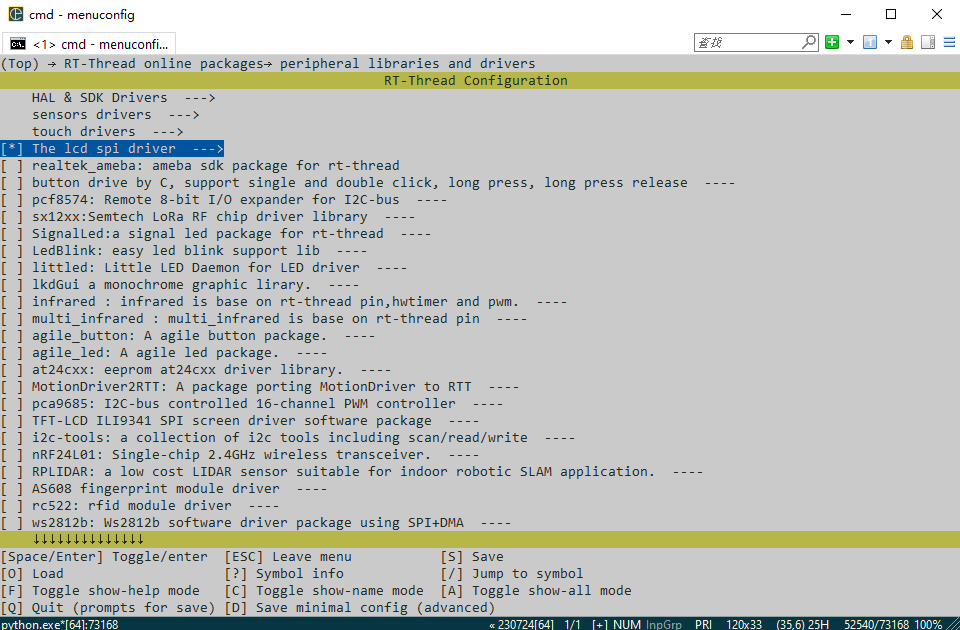
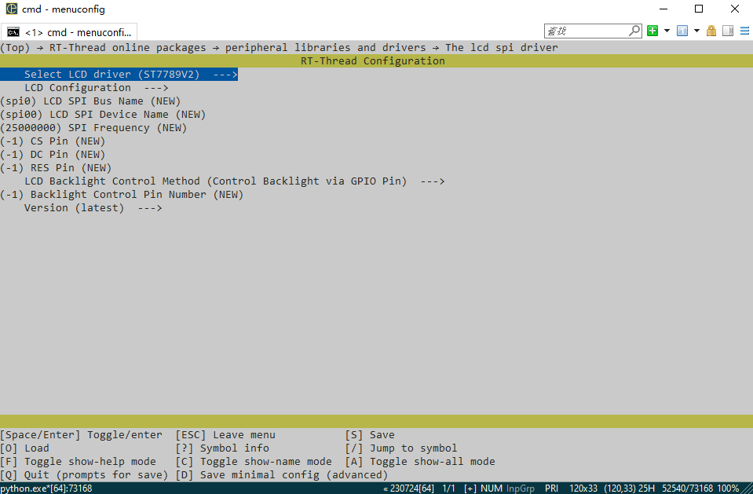
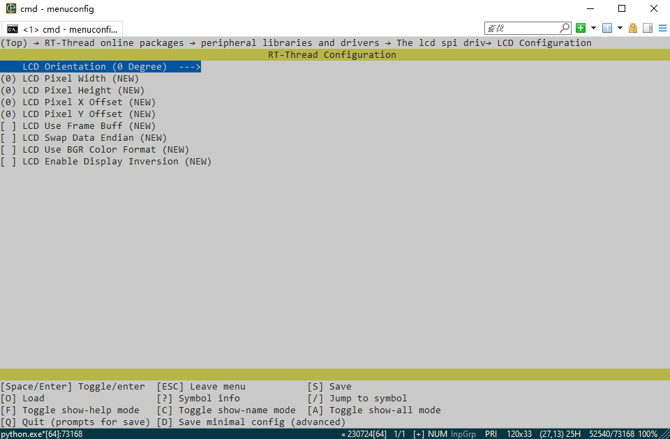

**English** | [中文](./README_zh.md) 

# nes simulator 

github: [PeakRacing/lcd_spi_driver](https://github.com/PeakRacing/lcd_spi_driver) (recommend)

gitee: [PeakRacing/lcd_spi_driver](https://gitee.com/PeakRacing/lcd_spi_driver) (updates may not be timely due to synchronization issues)

## Introduction

**Driver Support:**

- [x] ST7789V2

- [x] ST7735S

- [x] ST7796S

- [x] ILI9341

- [x] ILI9486

- [x] GC9A01

- [x] NV3030B

  **Note: If the LCD you are using is not on the driver support list, you can submit an issue for support, and you need to provide the manual or the original driver.**

## Instructions for Use

​	Enter `menuconfig` in the Env command line to access the configuration interface and configure the project.

​	Check to enable the package: `T-Thread online packages → peripheral libraries and drivers → [*] The lcd spi driver`

​	Configure according to your own LCD

- LCD Model(Select LCD driver)

- SPI Bus Name(LCD SPI Bus Nam)

- SPI Device Name(LCD SPI Device Name)

- SPI Frequency(SPI Frequency)

- SPI Chip Select Pin(CS Pin)

- LCD Data Select Pin(DC Pin)

- LCD Reset Pin(RES Pin)

  **These items are required configurations**

Then go into `LCD Configuration` settings

- LCD Orientation (LCD Orientation 可选 0° 90° 180° 270°)
- Resolution(LCD Pixel Width & LCD Pixel Heigh Take 0° as the reference; no need to consider the direction, it will automatically adjust.)
- Offset(LCD Pixel X Offset & LCD Pixel Y Offset)
- BUFF Mode(LCD Use Frame Buff There will be a screen-sized buff inside.)
- Swap Data Endian( LCD Swap Data Endian)
- BGR Format(LCD Use BGR Color Format)
- Inverse display(LCD Enable Display Inversion)

## Frequently Asked Questions

​	**Question: What should I do if the colors are abnormal?**

​	Answer: Check whether endian conversion is needed, BGR format, and inversion.

​	**Q: What should I do if it cannot display in full screen?**

​	A: Check if an offset needs to be set (you can check the original code provided by the screen manufacturer to see if there are any addition or subtraction offset operations in the parameters sent with commands 0x2A and 0x2B).

​	**Q: Why can't I find the package?**

​	A:Run `pkgs --upgrade` to update the latest package index

## Discussion group

​	**Non-technical support, only for the purpose of interest exchange.**

